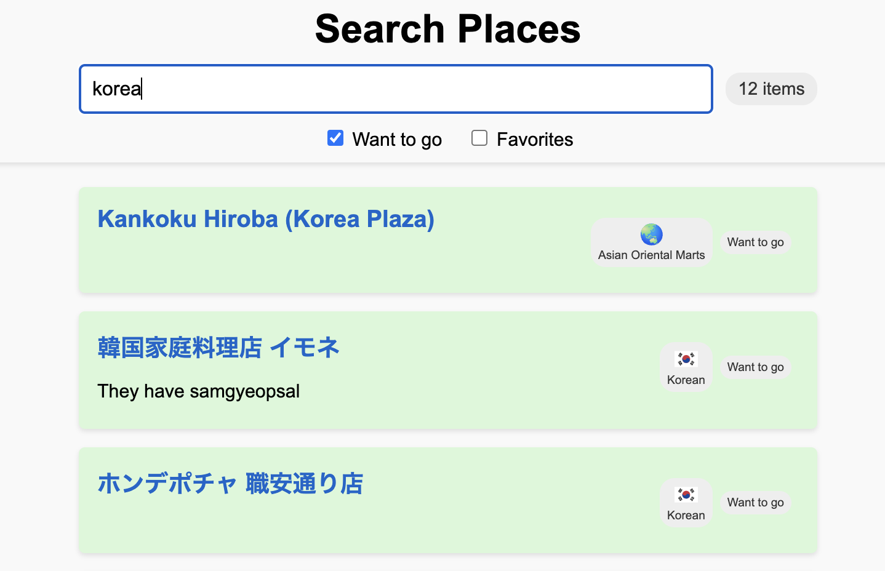

# Places Search Project

A lightweight web application that lets you browse and filter your Google Maps saved places by title, note, and tags. It features:
- A sticky header with a search bar
- Checkbox filters for "Want to go" and "Favorites"
- Tag badges with emoji icons (if available)
- Responsive two-column layout (details on the left, tags on the right)

## How to Get Your Google Maps Saved Data

1. **Google Takeout:**  
   Go to [Google Takeout](https://takeout.google.com/), sign in, and select only the **Saved** data under Google Maps (uncheck other items unless needed).

2. **Schedule and Wait:**  
   After scheduling the export, you’ll receive an email confirming that the takeout is in progress. It may take a few hours to complete—usually fast as the data isn’t huge.

3. **Download and Extract:**  
   Once ready, you’ll receive an email with a zip file containing CSV files—one for each saved list (note that other non-Google Maps data might also be included).

4. **Build Your JSON Database:**  
   - Place the provided `places.js` file in the same folder as your CSV files.
   - Run the script (e.g., `node places.js`) to convert the CSV files into a consolidated `places.json` file.
   - Make sure any required dependencies (like `csv-parser`) are installed (or include the `node_modules` folder).

## Setup

1. Put `index.html` and the generated `places.json` in the same folder.
2. Open `index.html` in a browser or run it via a local server (e.g., `python -m http.server`).
3. Enjoy filtering and browsing your saved places!

## Note 
- This was primarily built as a proof of concept using ChatGPT
- Future work should be done to refactor the code using best practices such as splitting CSS, JS files from the HTML